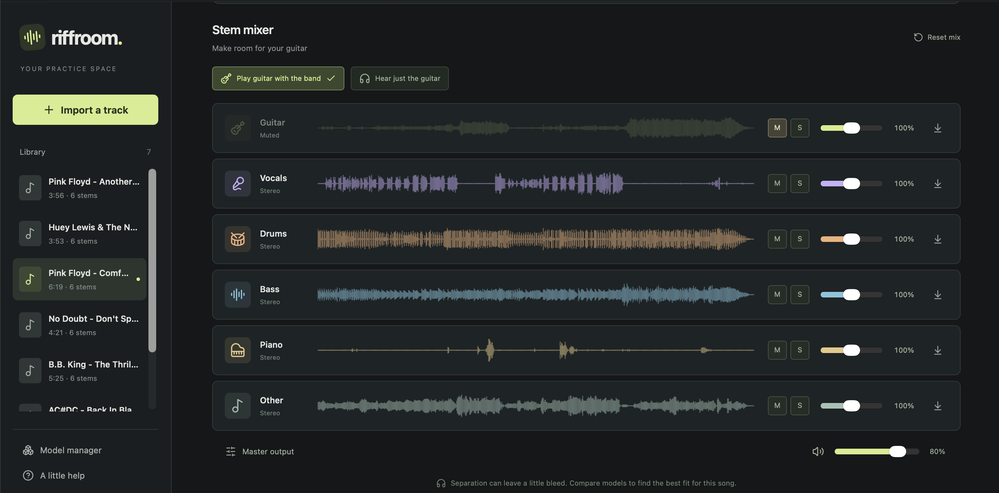

# Riffroom: turn a song into a backing track you can play with.



I built Riffroom for my own guitar practice and am sharing it in case you'd like to play with it too. Open a song, split it into instruments, then turn the guitar down or off and play along—or solo it to hear the part you're learning. Loop a tricky passage, slow it down without detuning, or transpose it to match your guitar. It all runs locally, with a mixer in your browser.

**Apple Silicon Mac is the supported song-splitting path today.** Experimental Linux and Windows source launchers are included; fresh-host validation is pending, and song splitting is not yet enabled on those platforms.

## What Riffroom does

- **Make a backing track:** mix guitar, vocals, drums, bass, piano and other instruments with the six-stem options. Each separated part is called a *stem*.
- **Listen closely:** solo the guitar, mute another instrument, or combine solos to hear how parts fit together.
- **Work on a passage:** set an A–B loop, change speed while preserving tuning, and adjust pitch independently.
- **Compare splitting methods:** keep multiple results for a song and switch between them and the original.
- **Keep your practice local:** save songs and results on your computer and download individual stems as WAV files. No account, API key, paid service or cloud upload is needed.

Song splitting is approximate: expect some instrument bleed and artifacts, especially in dense mixes. Different methods suit different songs.

## Practice

1. Choose a model, then drag an audio file into the window or click **Choose a track**.
2. Separation runs in the background; you can listen to the original while waiting. The library shows its status. One job runs at a time to limit GPU memory use.
3. **Play guitar with the band** mutes the guitar. **Hear just the guitar** solos it.
4. Use each stem's **M**, **S**, and volume slider. Volume runs from 0–200%; the master sets overall output. Multiple solos work together; mute takes precedence.
5. Seek to a passage, set **A** and **B**, and enable **Loop**. Space plays/pauses, and arrow keys skip five seconds when you aren't editing a control.
6. Try another model from the bottom of the track page. Each completed run remains available in **Listening to**, alongside the original.
7. Use a stem's download arrow to save its WAV file.

Mix levels, mutes, and solos are remembered per result in this browser. Track audio and all completed separation results persist on disk. Loop points, play position, speed, and master output currently reset when changing results. Speed changes tempo while preserving tuning, and the Pitch control transposes playback independently.

## Get started

Clone, download or unzip Riffroom into a writable folder, then use the launcher for your computer. First setup needs internet access to install dependencies and build the interface. Model weights download separately when first used.

### macOS · Apple Silicon

Double-click **`Riffroom.command`**, or run this from the project folder:

```bash
./start.sh
```

The launcher prepares the project and opens **http://127.0.0.1:8765**. Keep the Terminal window open; Control-C stops the server. Launching again reuses the running app.

An M1 or newer Mac is required; 16 GB memory is recommended. The app targets macOS 14 or later with a compatible MLX wheel. Existing validation used an M1 Mac on macOS 27; the pinned dependencies may need adjustment on older macOS versions. Intel Macs are outside the current supported path.

macOS keeps the full Apple Silicon stack and prefers MLX for the curated models. Setup accepts Python 3.11–3.13 and creates a standard virtual environment in `.env`; Conda is not required. If Python, Node.js/npm or FFmpeg/ffprobe is missing, it uses Homebrew to install the missing tool. If Homebrew is missing, it prints installation guidance. Apple's command-line tools are requested only if a package needs them.

### Linux · experimental

Install Python 3.11–3.13 with venv/pip support, Node.js 22+ with npm, and FFmpeg including ffprobe using your distribution's instructions. Then, from the project folder:

```bash
bash start.sh
```

Linux uses `scripts/setup_portable.py` and `requirements-core-lock.txt` to prepare the core app without installing MLX. It reports missing system tools rather than installing them for you.

### Windows · experimental

Install Python 3.11–3.13 with the Python launcher or PATH option, Node.js 22+ with npm, and FFmpeg with both `ffmpeg.exe` and `ffprobe.exe` on PATH. Reopen PowerShell, navigate to the project folder, and run:

```powershell
powershell -NoProfile -ExecutionPolicy Bypass -File .\Riffroom.ps1
```

`Riffroom.ps1` delegates to `start.ps1`, which uses the same portable/core setup as Linux. The execution-policy override applies only to this invocation; it does not change machine-wide policy. No administrator shell is required. Add `-NoBrowser` to start without opening a browser.

**Linux and Windows need fresh-host validation of both launch and song splitting.** The current model catalog still limits validated splitting capabilities to macOS ARM64, so a successful core launch does not enable splitting on these platforms. The portable splitting engine is a separate, explicit installation in Model Manager; the source launchers do not install it. See [validation notes](docs/validation.md#cross-platform-source-launcher-mvp) for the remaining checks.

### Setup checks and limits

Later launches reuse `.env` and refresh dependencies/builds when the setup fingerprint changes. Do not copy `.env` between machines or operating systems.

To inspect prerequisites without installing packages, building or starting the server:

```bash
# macOS or Linux
bash start.sh --check
```

```powershell
# Windows
powershell -NoProfile -ExecutionPolicy Bypass -File .\Riffroom.ps1 -Check
```

Uploads are limited to **512 MB and 20 minutes**. Decoded audio and stems use substantially more memory and disk than an MP3. The browser holds the selected result in memory, so shorter tracks and fewer tabs help on a 16 GB machine. A full song can take several minutes on an M1; progress reports stages, not a promised completion time.

### LAN access / testing another computer

The default is `127.0.0.1` (this computer only). Network binding is opt-in:

```bash
# macOS / Linux
./start.sh --host 0.0.0.0
# Optional: add --no-browser
```

```powershell
# Windows (start.ps1 accepts the same options)
powershell -NoProfile -ExecutionPolicy Bypass -File .\Riffroom.ps1 -BindAddress 0.0.0.0
# Optional: add -NoBrowser
```

Stop an existing server before changing its bind address. On another computer, open
`http://<server-LAN-IP>:8765`; the local browser uses `http://127.0.0.1:8765`.
You can replace `0.0.0.0` with a specific address assigned to the server.
Riffroom has no authentication: anyone who can reach the bound interface can access
the app and data. Use only on a trusted LAN. Windows/Linux fresh-host launch and
song-splitting validation are still pending.

## Choosing a splitting method

These curated choices are available through the Apple Silicon setup. Use Model Manager to explore other entries and manage the models in your selection menus; availability depends on your platform and installed tools.

| Model | Outputs | When to use it |
|---|---|---|
| Demucs · 6 stems | Guitar, vocals, drums, bass, piano, other | Default: a dependable balance of speed, memory and independent band controls. |
| RoFormer · 6 stems | Guitar, vocals, drums, bass, piano, other | Compare with Demucs on difficult mixes. More demanding on memory. |
| RoFormer · guitar focus | All guitars, rest of band | Try the dedicated guitar extractor when you mainly need guitar isolation/removal. No individual drum/bass faders in this mode. |
| Demucs · detailed 4 stems | Vocals, drums, bass, other | Fine-tuned ensemble for rhythm-section practice. Guitar stays in Other. Slower than the default. |

There is no universal best separator for every song. Start with Demucs, compare the six-stem RoFormer, and try guitar focus when guitar clarity matters most. The smoke tests verify functioning inference and aligned output, **not perceptual superiority**. Dense distortion, effects, and overlapping instruments can leave bleed or remove useful detail. Demucs's piano output is experimental.

**Lead versus rhythm guitar:** the included models put them in one guitar stem. Research did not establish a dependable, openly available local lead/rhythm checkpoint suitable for this Mac. Riffroom does not relabel a stereo or frequency split as AI-separated lead/rhythm. The model adapter and arbitrary stem list allow such a model to be added later.

Model research, primary sources, and weight licensing are in [docs/models.md](docs/models.md). The application uses open-source tools. Community model weights have separate terms: the default Demucs option is MIT; the guitar specialist is authorized by its author for non-commercial use; the RoFormer SW weight redistribution license is unverified. Keep this distinction in mind if turning the personal app into a distributed product.

## Local files and privacy

- `data/tracks/<id>/original.wav`: imported, decoded 44.1 kHz stereo copy.
- `data/tracks/<id>/track.json`: track metadata and completed run references.
- `data/tracks/<id>/runs/<run-id>/`: model outputs, waveforms and diagnostic log.
- `data/models/`: downloaded/converted weights, reusable across songs.
- `data/runtimes/`: separately installed portable splitting engine, when requested in Model Manager.
- `.env/`: isolated, project-local standard Python virtual environment.

Deleting a track removes its Riffroom copy and results. It never touches the source file you imported. Back up `data/tracks` to preserve your library; browser local storage holds mixer preferences. Set `RIFFROOM_DATA` before launch to select another data folder: `RIFFROOM_DATA=/absolute/path ./start.sh` on macOS/Linux, or `$env:RIFFROOM_DATA = "C:\path\to\data"` in PowerShell before running the Windows launcher.

Models require internet for the initial download. Once their weights/configs are cached, normal separation runs locally. Cancelling a job keeps previous successful results and does not publish partial stems. Download files are committed atomically so interrupted downloads can be retried. Converted weights can occupy several GB; the four prepared curated profiles used roughly 3 GB on the development Mac. Other models and the optional portable engine need additional space.

The server listens on `127.0.0.1` by default and rejects unexpected hostnames. Explicit network binding permits the chosen host (any host for wildcard binds); cross-origin mutations remain rejected. It is a single-user local app, not an authenticated network service.

## Development

The stack is **Python/FastAPI + React/TypeScript/Vite + Web Audio**, with FFmpeg for decoding and MLX for the primary Apple Silicon splitting path. The portable engine uses a separate managed environment. Python suits the ML ecosystem; TypeScript keeps UI and audio state explicit. One production server serves both UI and API.

The commands below use the macOS/Linux environment layout; on Windows, the Python executable is `.env\Scripts\python.exe`. The macOS setup includes development tools; core-only installs need the `dev` extra for backend checks.

```bash
# Backend (do not use multiple workers; the job queue is local to this process)
.env/bin/python -m uvicorn riffroom.app:app --host 127.0.0.1 --port 8765

# Optional frontend dev server, in another terminal
npm run dev --prefix frontend

# Build after UI changes
npm run build --prefix frontend

# Checks
.env/bin/pytest -q
.env/bin/ruff check backend scripts
npm test --prefix frontend

# Browser integration test: uses installed Google Chrome and a running server
.env/bin/python scripts/make_test_audio.py
npm run test:e2e --prefix frontend
```

The browser test imports an original synthetic fixture, runs the real default ML model, verifies playback/mixer/loop/storage/cancellation/downloads, and deletes that test track. This workflow targets the validated Apple Silicon setup and needs GPU access and initially model-download access. See [docs/architecture.md](docs/architecture.md) for extension points and [docs/validation.md](docs/validation.md) for what was verified.

## Troubleshooting

- **First separation is slow:** weights need to download and convert once. Leave the server running.
- **Older Demucs stems sound buzzy/noisy:** the original cached-weight loader had a bug, now fixed. Select Demucs and click **Separate track** again; existing WAVs cannot be repaired in place. New workers load the corrected adapter automatically.
- **Job fails:** open its diagnostic log in the track page. Try again, or use Demucs six stems if RoFormer exhausts memory.
- **No sound:** press Play, check master/mute/solo controls and your computer's output device. Browser audio needs a user click.
- **Server was closed:** run your platform’s launcher again. Interrupted jobs are marked for retry; finished results remain.
- **Port 8765 in use:** the launcher reuses Riffroom if it owns the port; otherwise it asks you to stop the other app.
- **SDK build error:** make sure `xcrun --sdk macosx --show-sdk-path` resolves to an SDK compatible with the selected Xcode toolchain. Setup already includes the workaround used on this Mac.
- **Shared Homebrew on a multi-user Mac:** setup can use compatible tools that are already installed, including an unlinked supported Python. If another account owns Homebrew and a tool is missing, use that account or ask an administrator to install the tool.
- **No splitting options on Linux/Windows:** these launchers currently prepare only the core app; model capabilities remain limited to validated macOS ARM64 execution. Fresh-host splitting validation is still pending.
